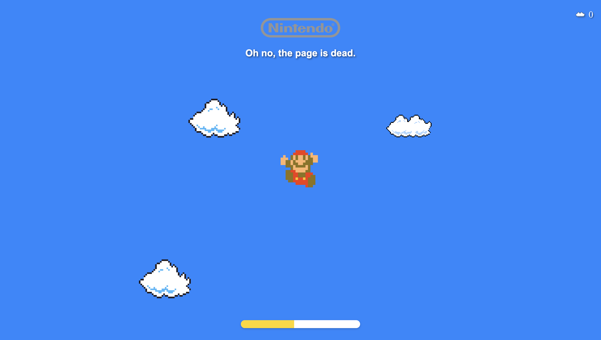

# 設計理念
## 選擇的網站：[任天堂官網](<https://www.nintendo.com/tw/>)


等候網頁風格說明
- 在網頁中使用了任天堂經典的角色ip讓人一眼就知道是任天堂的網站
- 使用的顏色也盡可能的貼合大眾印象中的瑪利歐遊戲中的的配色
- 加入簡單低效能使用的小遊戲來呼印任天堂所販售的商品




# 網頁技術介紹


## 1. HTML 部分


HTML 為網頁的骨架，本網頁主要使用了以下元素：
- **`<!DOCTYPE html>` 與 `<html>`**：定義文件類型與語言（此處設為中文）。
- **`<head>` 區塊**：包含 `<meta>` 標籤（設定字元編碼與視窗），`<title>` 標題，以及內嵌的 `<style>` 區塊，定義 CSS 樣式。
- **`<body>` 區塊**：放置網頁內容，包括圖片、文字、進度條、計數器等元素。

範例程式碼片段：
```html
<!DOCTYPE html>
<html lang="zh">
<head>
    <meta charset="UTF-8">
    <meta name="viewport" content="width=device-width, initial-scale=1.0">
    <title>Document</title>
    <style>
      /* CSS 內容放置於此 */
    </style>
</head>
<body>
    
    <div class="dead-text">Oh no, the page is dead.</div>
    <!-- 更多內容 -->
</body>
</html>
```
這部分建立了基本結構與引入其他技術（CSS 與 JavaScript）的入口。

---

## 2. CSS 部分


CSS 用來美化網頁及控制動畫效果。網頁中主要的 CSS 設計包括：
- **全局設定**：例如 `body` 設定背景色、邊距、以及 overflow 行為，確保整個頁面風格統一。
- **定位與佈局**：利用 `position: fixed/absolute`、`transform` 等屬性來調整元素（如 Mario、Logo、進度條等）的顯示位置。
- **動畫效果**：  
  - **`@keyframes flip`**：讓 Mario 角色呈現左右翻轉的效果。  
  - **`@keyframes moveUp`**：讓雲朵以線性動畫從下向上移動。
- **進度條與碰撞計數**：使用 CSS 設計進度條的外觀、圓角、陰影等，並搭配 `::after` 生成動畫效果。

範例程式碼片段：
```css
body {
    margin: 0;
    padding: 0;
    background-color: #1888FF;
    min-height: 100vh;
    overflow: hidden;
    position: relative;
}

.mario {
    position: fixed;
    left: 50%;
    top: 50%;
    transform: translate(-50%, -50%);
    width: 100px;
    animation: flip 0.6s linear infinite;
}

/* 翻轉動畫 */
@keyframes flip {
    0%, 49.9% {
        transform: translate(-50%, -50%) scaleX(1);
    }
    50%, 100% {
        transform: translate(-50%, -50%) scaleX(-1);
    }
}
```

---

## 3. JavaScript 部分


JavaScript 為網頁帶來動態互動功能，主要包括：
- **隨機調整雲朵位置**：利用 `Math.random()` 為每個雲朵隨機設定起始位置，增加畫面變化。
- **控制 Mario 移動**：  
  - 監聽鍵盤事件（`keydown`），根據使用者按下左或右鍵來改變 Mario 的水平位置（`marioX`），並根據移動方向調整縮放效果（`scaleX`），達到翻轉效果。
- **持續碰撞檢測**：  
  - 使用 `requestAnimationFrame` 不斷執行 `checkCollision()` 函數，檢查 Mario 與雲朵之間是否發生碰撞，並更新碰撞計數器。

範例程式碼片段：
```js
// 隨機調整雲朵的初始位置
document.querySelectorAll('.cloud').forEach(cloud => {
    cloud.style.left = Math.random() * 80 + 10 + '%';
});

// 監聽鍵盤事件控制 Mario 的左右移動
document.addEventListener('keydown', (event) => {
    switch(event.key) {
        case 'ArrowLeft':
            marioX = Math.max(50, marioX - moveSpeed);
            facingRight = false;
            break;
        case 'ArrowRight':
            marioX = Math.min(window.innerWidth - 50, marioX + moveSpeed);
            facingRight = true;
            break;
    }
    updateMarioPosition();
});
```


